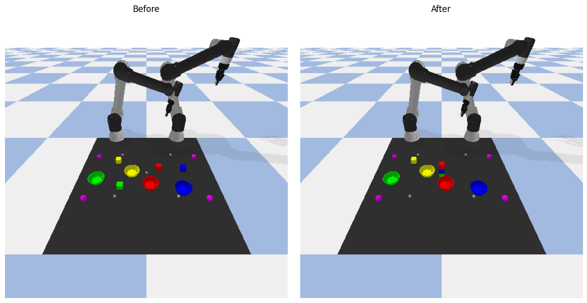
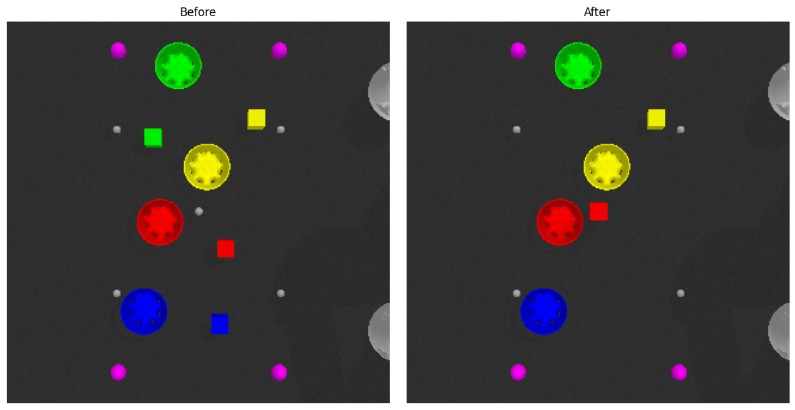

# 🤖 LiP-LLM: Linear Programming + LLM-Based Multi-Robot Task Planning

This project demonstrates a minimal implementation of **LiP-LLM**, a hybrid framework that integrates **Large Language Models (LLMs)** with **Linear Programming (LP)** for symbolic **multi-robot task planning**. Using PyBullet simulation, a pair of robotic arms interprets natural language commands to complete structured pick-and-place operations.

---

## 📁 Contents

- `lipllm.ipynb` — Main Jupyter Notebook implementing the LiP-LLM pipeline
- `environment.yml` — Conda environment definition for dependency setup
- `README.md` — Project documentation (you’re reading it!)
- `LICENSE` — MIT license (free to use and modify)

---

## 🧠 Key Features

✅ Accepts natural language instructions  
✅ Converts language into symbolic robot skills  
✅ Uses LP-based task allocation to assign skills to each robot  
✅ Executes skills in PyBullet dual-arm simulation  
✅ Renders before/after top-down views of environment  

---

## ⚙️ Setup Instructions

> ⚠️ Prerequisite: [Miniconda](https://docs.conda.io/en/latest/miniconda.html) or [Anaconda](https://www.anaconda.com/) installed

1. **Clone this repository**:
   ```bash
   git clone https://github.com/your-username/lip-llm-sim.git
   cd lip-llm-sim
2. **Create and activate the environment**:
    ```bash
    conda env create -f environment.yml
    conda activate lip-llm-env
3. **Launch the notebook**
    ```bash
    jupyter notebook trial.ipynb

## Dependencies
Installed automatically via environment.yml. Main packages:

1. pybullet – physics-based robot simulation
2. numpy, scipy – math and optimization
3. matplotlib – image plotting
4. gemini (or any LLM interface) – skill generation
5. collections – for task queueing

## Sample Output
Put the blue block on green block, put the red block on blue block and put the green block in center.


Stack the red, blue and green block in order.



## Project Flow
Natural Language → LLM → Symbolic Skills → LP Allocation → Simulation Execution

run_assignments() 
└── parse_command()
    └── add_task()
        └── process_tasks()
            ├── pick_and_place()
            └── wait()


## File Structure
lip-llm-sim/
├── lipllm.ipynb           # Main simulation pipeline
├── environment.yml       # Conda env definition
├── LICENSE               # MIT License
└── README.md             # This file

## 📚 References
This implementation is based on the paper:

Integrating Linear Programming and Dependency Graphs with LLMs for Multi-Robot Task Planning
